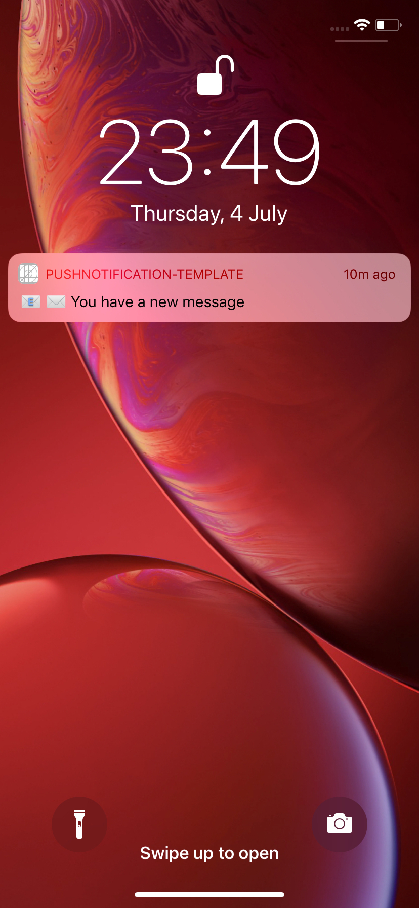

# PushNotification with NodeJs Server.
**PushNotification-Template** is a project for learning how to make PushNotifications.


<br>




## Dependencies

- NodeJS:
    - [node-apn](https://github.com/node-apn/node-apn)
    - [Tutorial](https://solarianprogrammer.com/2017/02/14/ios-remote-push-notifications-nodejs-backend/)

## Installing

For run the server we can go the folder with have the file `package.json`. 

1. Installing NodeJs dependecies:

```shell
$ npm install
```

2. Run the Server:

```shell
$ npm start
```

## Thank for watch!

